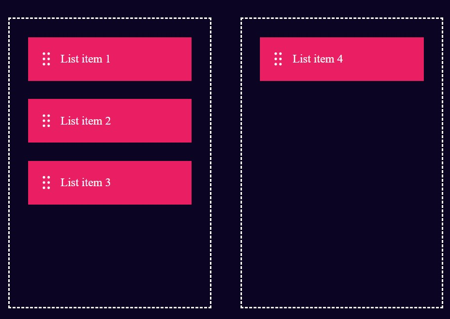

## 🖱️ Drag and Drop  

A **Drag and Drop** functionality built using HTML, CSS, and JavaScript. This project allows users to move elements by dragging and dropping them within the interface, making it perfect for interactive applications, file management, and UI customization.  

## 🚀 Features  
- ✅ Simple and smooth **drag-and-drop** functionality  
- ✅ Supports **multiple draggable elements**  
- ✅ Clean and responsive design  
- ✅ Lightweight and easy to integrate into any project  

## 🛠 Tech Stack  
HTML, CSS, JavaScript  

## 📷 Screenshots  
  
  

## 📌 How It Works  
1. Click and hold an element to **drag** it.  
2. Move the element to a **drop zone**.  
3. Release the element to **drop** it in the desired location.  
4. The system ensures smooth transitions and user-friendly interactions.  

## 📥 Download & Installation  
Clone the repository using Git:  
```bash
git clone https://github.com/aklema094/Drag-and-Drop.git
```  
Or download the ZIP file manually from [here](https://github.com/aklema094/Drag-and-Drop/archive/refs/heads/main.zip).  
